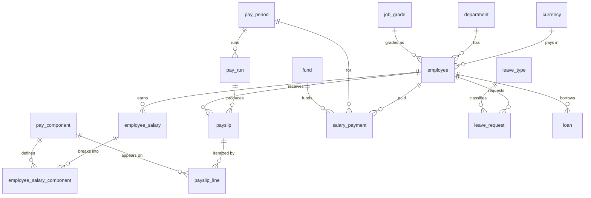

# Data Model

The PaySQL schema (Phase 1) is defined as Flyway migrations under
[`db/migrations/`](../db/migrations). It replaces the original coursework schema and fixes its
datatype and spelling problems.

## What changed from the original

| Original | PaySQL |
|---|---|
| `join_date VARCHAR2(20)`, `l_month VARCHAR2(15)` | Real `DATE` columns and a `pay_period` table |
| `basic INT`, `allowance INT` | `NUMBER(14,2)` money, **as pay components** |
| `TRANSECTION`, `ammount` | `salary_payment`, `amount` (correct spelling) |
| Fixed salary columns | `pay_component` + `employee_salary_component` (configurable) |
| Salary overwritten on change | `employee_salary` with `valid_from` / `valid_to` (history kept) |
| Print-only triggers | `audit_log` + `error_log` tables |
| `Check_Valid` cursor loop for "already paid" | `UNIQUE (employee_id, pay_period_id)` constraint |

## Entity-relationship diagram

## Table overview

| Group | Tables |
|---|---|
| **Reference** | `currency`, `department`, `job_grade`, `pay_component`, `leave_type`, `tax_slab` |
| **Core HR** | `employee` |
| **Compensation** | `employee_salary`, `employee_salary_component` |
| **Payroll** | `pay_period`, `pay_run`, `payslip`, `payslip_line`, `salary_payment`, `fund`, `leave_request`, `loan` |
| **Audit** | `audit_log`, `error_log` |
| **Reporting views** | `v_current_salary`, `v_payslip_detail`, `v_payroll_register` |

## Key design choices

- **Compensation is data.** Earnings and deductions are rows in `pay_component`, assigned per
  employee in `employee_salary_component` — no hardcoded salary columns or percentages.
- **Effective-dated salary.** A raise inserts a new `employee_salary` revision; the old one is
  closed with `valid_to`, never deleted.
- **Idempotent payments.** `salary_payment` has `UNIQUE (employee_id, pay_period_id)`, so an
  employee can't be double-paid for a period — enforced by the database, not a cursor scan.
- **Real types everywhere.** Money is `NUMBER(p,s)`, dates are `DATE`, identifiers use Oracle
  `IDENTITY` columns.
