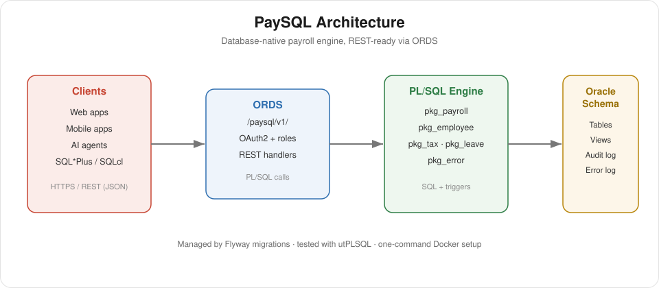

# PaySQL Documentation

**PaySQL** is an open-source, modular, REST-ready **payroll & salary-management platform built on
Oracle PL/SQL**. It manages employees, component-based compensation, leave, tax and statutory
deductions, and full pay-run cycles — with the database as the source of truth and a REST API
(via ORDS) for web, mobile, and AI-agent clients.

If you're looking for an **open-source payroll system**, an **Oracle PL/SQL salary management**
engine, or a **database-native HRIS/payroll** you can self-host and extend, PaySQL is designed
for you.

## Start here

- [Modernization Proposal & Roadmap](./PROPOSAL.md) — the plan, feature vision, and phases
- [Getting Started](./getting-started.md) — install and run
- [Architecture](./architecture.md) — how PaySQL is structured

## Reference

- [Data Model](./data-model.md)
- [Payroll Engine](./payroll-engine.md)
- [API](./api.md)
- [Configuration](./configuration.md)
- [Roles & Security](./roles-and-security.md)

## Contributing

See [CONTRIBUTING.md](../CONTRIBUTING.md) and [AGENTS.md](../AGENTS.md).
